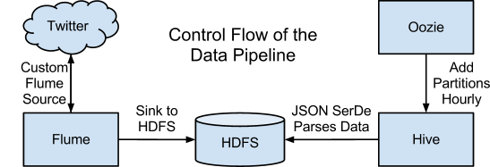

# 读书笔记
-----
强烈推荐使用safaribookonline阅读
-----

**Storm real-time processing cookbook(2013)  **
综合评价：只能作为实例的参考书，让人又爱又恨。 $$3/5$$
简介：以实例为主，不适合初学者上手，其中对于基本概念的讲解实在让人汗颜。有完整的代码示例。
  - Chapter 3: 计算TF-IDF,作者希望通过此章介绍Trident(Storm的高级元语言)，但是除了对代码做了简单注释，对基本概念完全没有讲清楚,代码中混入了大量的Trident的复杂概念。并且除Trident编程之外，又混入了DRPC的知识，也没有讲解，让人不明所以.

**Storm Blueprints:Patterns for Distributed Real-time Computation (Packt, 2014)**
综合评价：强烈推荐！！！Storm入门首选。唯一美中不足，缺失两章代码。
简介：内容涉及方面与Storm Cookbook类似，但是对基础概念讲解相当透彻
  - Chapter :介绍了Graph analysis的基本知识，

**Graph Databases, 2nd Edition (O'Reilly, 2015)**
- Chapter 2: Options for Storing Connected Data: Relational Database和普通的NoSQL的表之间都缺乏relationship (隐含)， Graph Database删除表示relationship
- Chapter 3: Data Modeling with Graphs: 简介Cypher(Graph query language). Compare Relational database (tables, normalization, denormalization) and graph modeling

**Cassandra Design Patterns （Packt, 2014）**

**[Microsoft Application Architecture Guide, 2nd Edition](https://msdn.microsoft.com/en-us/library/ff650706.aspx)**


## Big Data
大数据本质是掌握工具框架，入门之后还是靠语言积累，所以还是算法+数据结构。  
所有大数据工具推荐学习顺序：  
Standalone --> 运行实例 --> 修改实例 --> 开发实例 --> Cluster mode
### Storm
Standalone mode
Cluster mode
### Apache Hadoop
####Apache Oozie

### Apache Kafka
console and java driver
####坑
DataStax的cassandra core依赖项问题


### Apache Spark

### Apache Cassandra
分布式Column-based Database
####坑
配置文件千万不要在前面加空格，否则报错

### Apache Flume

### Google Cloud Dataflow

### Apache Mesos
Mesos: An open-source cluster manager. Mesos is a cluster manager aiming for improved resource utilization by dynamically sharing resources among multiple frameworks.  
提高资源利用率  
Shared Cluster


### Apache Hama


### Apache Giraph

## DevOps
### Vagrant
### Docker
### Puppet


## Data Visualization
### D3.js
#### Map

### Mapbox
优势：高精度， high resolution


## Database
### Graph Database
#### Cypher
Cypher: graph database query language  
examples
```
(emil)<-[:KNOWS]-(jim)-[:KNOWS]->(ian)-[:KNOWS]->(emil)
```
```
MATCH (a:Person {name:'Jim'})-[:KNOWS]->(b)-[:KNOWS]->(c),
      (a)-[:KNOWS]->(c)
RETURN b, c
```
```
MATCH (a:Person)-[:KNOWS]->(b)-[:KNOWS]->(c), (a)-[:KNOWS]->(c)
WHERE a.name = 'Jim'
RETURN b, c
```

#### Neo4j


## max-min fairness
DRF(Domainant Resource Fairness)
sharing Incentive, strategy Proofness, Envy Freeness, Pareto Efficiency


### 经典论文


## 有趣的项目: https://github.com/cloudera/cdh-twitter-example
Machine Learning预测《冰与火之歌》中的叛徒


# Blog

###[]**Analyzing Twitter Data with Apache Hadoop**
[How-to: Analyze Twitter Data with Apache Hadoop](https://blog.cloudera.com/blog/2012/09/analyzing-twitter-data-with-hadoop/)
[Analyzing Twitter Data with Apache Hadoop, Part 2: Gathering Data with Flume](http://blog.cloudera.com/blog/2012/10/analyzing-twitter-data-with-hadoop-part-2-gathering-data-with-flume/)
[Analyzing Twitter Data with Apache Hadoop, Part 3: Querying Semi-structured Data with Apache Hive](http://blog.cloudera.com/blog/2012/11/analyzing-twitter-data-with-hadoop-part-3-querying-semi-structured-data-with-hive/)
  **[Source Code](https://github.com/cloudera/cdh-twitter-example)**: https://github.com/cloudera/cdh-twitter-example

Flume pipeline


###**[Architectural Patterns for Near Real-Time Data Processing with Apache Hadoop](http://blog.cloudera.com/blog/2015/06/architectural-patterns-for-near-real-time-data-processing-with-apache-hadoop/)**
introduce four NRT(Near Real-Time) architecutre of hadoop
- Stream ingestion
- Near Real-Time (NTR) Event Processing with External Context
- NRT Event Partitioned Processing
- Complex Topology for Aggregations or ML


###**[How Spotify Scales Apache Storm](https://labs.spotify.com/2015/01/05/how-spotify-scales-apache-storm/)**
High-level description of Storm Scale. 主要涉及了大量的实际优化操作。
- Source and Sink Tuning
  - Kafka Tuning
  - Cassandra Tuning
- Concurrency Issues
  - OutputCollector in Storm is not thread-safe
  - Parallelism Tuning
- Caching for Bolts: Guava's [Expirable Cache](https://code.google.com/p/guava-libraries/wiki/CachesExplained)

###**[Scaling Apache Storm - Strata + Hadoop World 2014](http://www.slideshare.net/ptgoetz/scaling-apache-storm-strata-hadoopworld-2014?qid=19b9de2b-175b-415e-94c8-7a537d8c2a9a&v=qf1&b=&from_search=2)**
提高Storm performance的方法
- 分开考虑CPU,I/O，Disk的性能
- Key Settings
  - topology.max.spout.pending: when reached, Storm will temporaily stop emitting data from Spout(s)
  - topology.message.timeout.secs: bottleneck solution, increase timeout and/or inrease component parallelism
- Externalize Configuration: no hard code for number of parallelism, props.get("num.workers")

###**[Latency Numbers Every Programmer Should Know](https://gist.github.com/jboner/2841832)**
L1 cache reference                           0.5 ns  
Branch mispredict                            5   ns  
L2 cache reference                           7   ns                      14x L1 cache  
Mutex lock/unlock                           25   ns  
Main memory reference                      100   ns                      20x L2 cache, 200x L1 cache  
Compress 1K bytes with Zippy             3,000   ns        3 us  
Send 1K bytes over 1 Gbps network       10,000   ns       10 us  
Read 4K randomly from SSD*             150,000   ns      150 us          ~1GB/sec SSD  
Read 1 MB sequentially from memory     250,000   ns      250 us  
Round trip within same datacenter      500,000   ns      500 us  
Read 1 MB sequentially from SSD*     1,000,000   ns    1,000 us    1 ms  ~1GB/sec SSD, 4X memory  
Disk seek                           10,000,000   ns   10,000 us   10 ms  20x datacenter roundtrip  
Read 1 MB sequentially from disk    20,000,000   ns   20,000 us   20 ms  80x memory, 20X SSD  
Send packet CA->Netherlands->CA    150,000,000   ns  150,000 us  150 ms  


### **[CALCULATING A NETWORK MAP BY ANALYZING TWEETS](http://mark-kay.net/2014/01/15/calculating-a-network-map-by-analyzing-tweets/)**

### **[GENERATING A NETWORK GRAPH OF TWITTER FOLLOWERS USING PYTHON AND NETWORKX](http://mark-kay.net/2014/08/15/network-graph-of-twitter-followers/)**

### **[DETECT VEHICLES FROM A CCTV IMAGE](http://104.155.47.149:5000/http://mark-kay.net/2014/06/24/detecting-vehicles-cctv-image/)**

### **[DataMap](http://datamaps.github.io/)**
a wrapper map library of d3.js. 主要用作生成动态地图，可以直接参考源码。


### **[d3 mapbox.js example](http://bl.ocks.org/feomike/5967885)**
an example which combines d3.js and mapbox.js

### **[How does a relational database work](http://coding-geek.com/how-databases-work/)**
中文译文： http://blog.jobbole.com/100349/?hmsr=toutiao.io&utm_medium=toutiao.io&utm_source=toutiao.io  
详细介绍了关系型数据库的原理


### **[Building an ETL pipeline from scratch in 30 minutes](https://www.youtube.com/watch?v=hjwKKgWbMF0)**
Google Cloud Dataflow的视频，简述了Python SDK的应用。用pipeline (|) 来传输数据，效果类似Storm+Hadoop的编程模型。

### **[ZooKeeper简介](http://www.cnblogs.com/loveis715/p/5185796.html)**


# Online Courses
免费收费课程
- Udacity: 个人认为最适合入门的一套课程
- edx：公开课鸽子王，课程长期跳票
- Big Data University
- Coursera: 整体课程偏理论，而且并不深入，实战内容较少
- 慕课网
- 麦子学院: 有涉及到架构的课程，讲课老师的整体实力较强
- 宅客学院
- MIT opencourse
- 极客学院： 课程较新，但是讲师的水平和普通话水平参差不齐。但整体来说一年花260元买个会员还是利大于弊的。
- Datastax: 主讲Cassandra，以练习为主
- safaribookonline：
- 学堂在线：以清华课程为主，课程涉及内容较为细致，但是视频加载速度不太理想
- [Hortonwork](http://hortonworks.com/tutorials/) 系列课程：


# TODO
- [] s3-file-server
- [] MapReduce Design Pattern